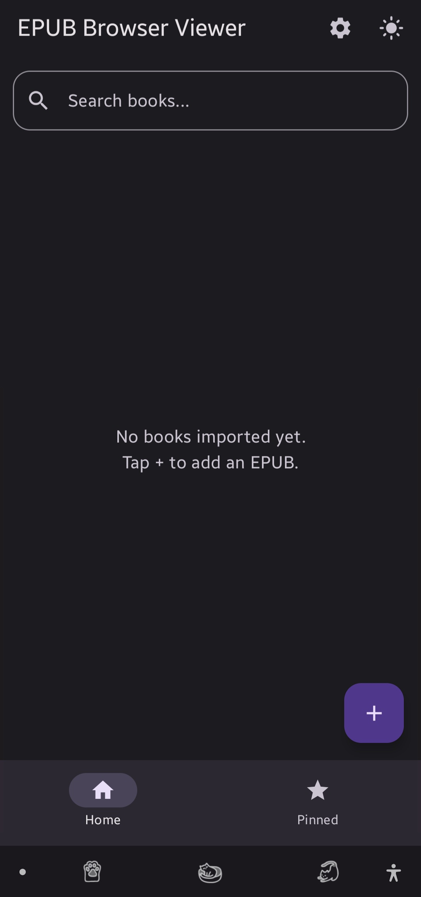
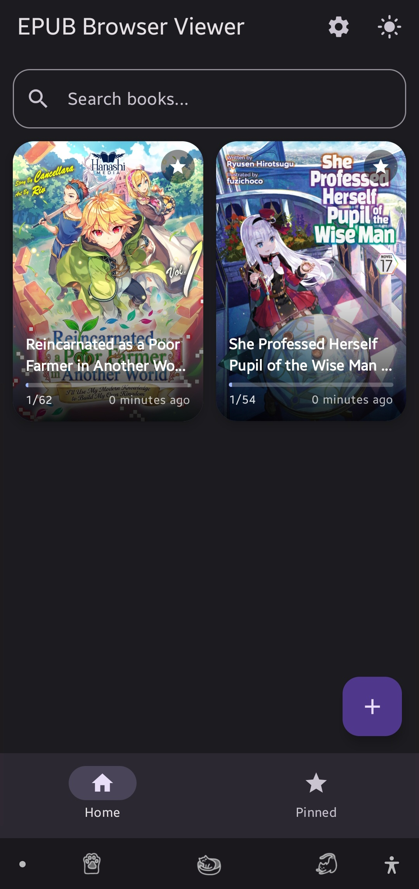
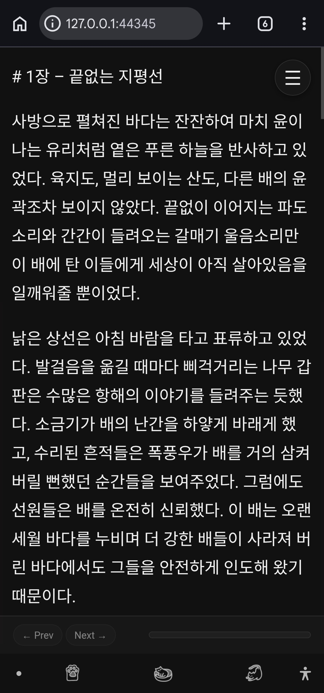
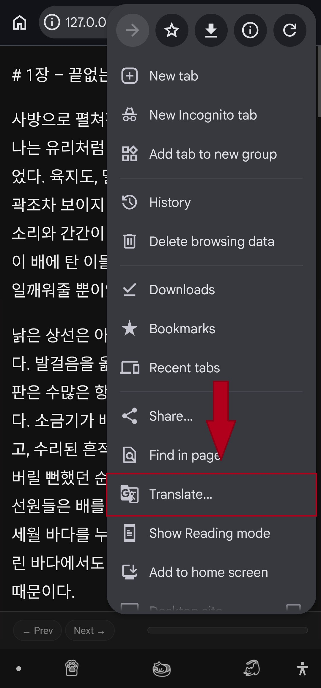
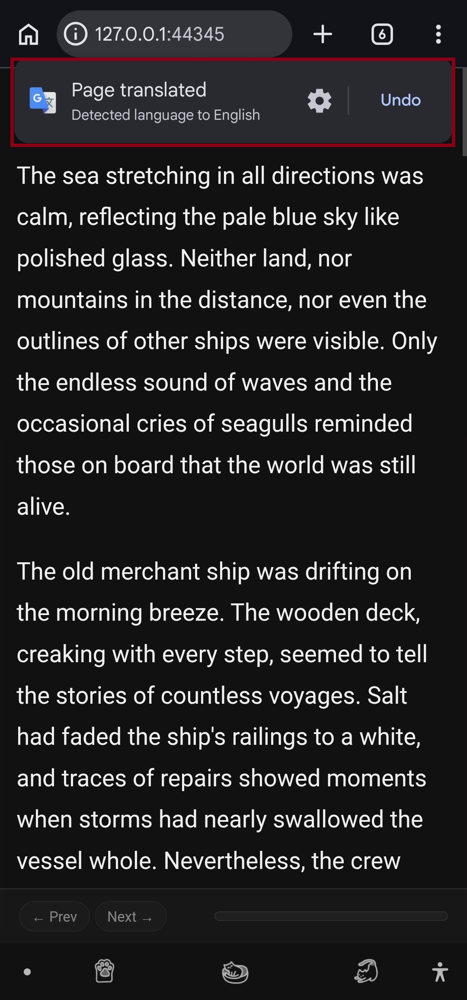

# EPUB Web Viewer

EPUB Web Viewer is an Android app that lets you read and translate EPUB novels using your browser.

Instead of using a built-in reader, the app opens the book in Chrome (or another browser) through a local server. This allows you to use the browser's translation feature to translate entire chapters into your preferred language.

## Features

* Import EPUB books
* Read books in your browser
* Translate books using browser translation
* Automatically save reading progress
* Remember font size, theme, and reader settings
* Chapter navigation
* Dark and light themes

## Why I Made This

Many EPUB readers only translate selected text. I wanted a simple way to read entire foreign-language novels using browser translation while keeping reading progress and reader settings.

## How It Works

1. Import an EPUB file.
2. Open the book.
3. The app launches a browser reader.
4. Use your browser's translate feature.
5. Read in your preferred language.

## Requirements

* Android 8.0 (API 26) or newer

## Screenshots

### 1. Import and manage your EPUB library

  &nbsp;&nbsp;&nbsp;&nbsp;&nbsp;&nbsp;&nbsp;&nbsp;
  

### 2. Open any chapter in your browser

  

### 3. Translate with Chrome's built-in translation

  &nbsp;&nbsp;&nbsp;&nbsp;&nbsp;&nbsp;&nbsp;&nbsp;
  

## Download

Download the latest APK from the **Releases** section.

## License

Free to use, modify, and distribute for personal or commercial purposes.

You may:

* Use the project freely.
* Modify the source code.
* Create your own versions.
* Distribute modified versions.

Attribution is appreciated but not required.
